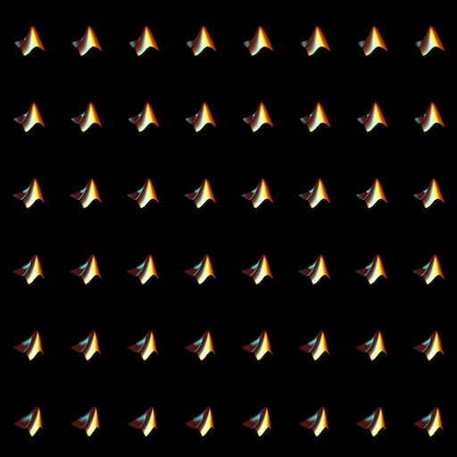

# quiltrendermat
A Matlab quilt rendering tool for 3D figures and plots for viewing on 3D light field displays made by the Looking Glass Factory.
A quilt is a composite image that contains a grid of up to 48 different renders of a scene separated by approx 1 degree. It uses the Matlab Python engine to call a python helper utility to communicate with the Looking Glass HoloPlay driver via a websocket.

(c) Holoxica Limited 2022, an authorised partner of the Looking Glass Factory. Holoxica specialises in engineering, scientific and medical visualization. www.holoxica.com

